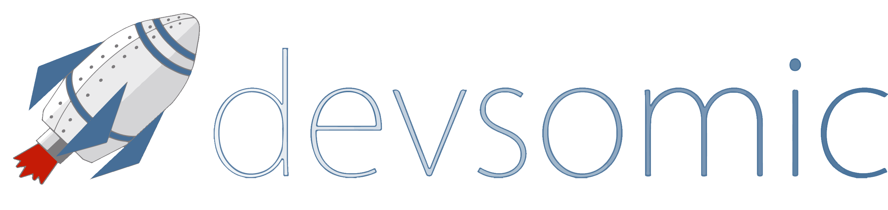

## Devsomic - Developing ideas, building apps. Mobile applications for humans

We craft digital products like mobile apps for fun and learning. We started devsomic some years ago during our Computer Science studies, and now it's a friends-brand for building the projects we love.

### Our projects

We developed some projects previously like [uPadel](https://play.google.com/store/apps/details?id=com.devsomic.upadel), [Filmtastic](https://play.google.com/store/apps/details?id=es.mimo.filmtastic) or [Starship Sale](https://play.google.com/store/apps/details?id=com.upsa.mimo.starshipsale) but our most useful project is [uWiFi](https://play.google.com/store/apps/details?id=com.devsomic.uwifi) 

### UWiFi

uWiFi is an Android app that lets users to set up their university accounts to connect to [EDUROAM](https://www.eduroam.org/) WiFi. Nowadays, there is only available the uWiFi app fixed for the [University of Salamanca's](http://usal.es) users.
    
    Our app is not availabe at this moment in Google Play due an image conflict with the University of Salamanca. While this issue is solved donwload the APK from [here](https://drive.google.com/file/d/0BwS7cZg3riXtaUZxd3RXQ0k2WEE/view?usp=sharing)

### Contact us

If you want to ping us, send us an email to [devsomic@gmail.com](mailto:devsomic@gmail.com) or follow us in:

* Twitter [@devsomic](https://twitter.com/devsomic)
* Facebook [@devsomic](https://facebook.com/devsomic)
* [Website](http://devsomic.com)
